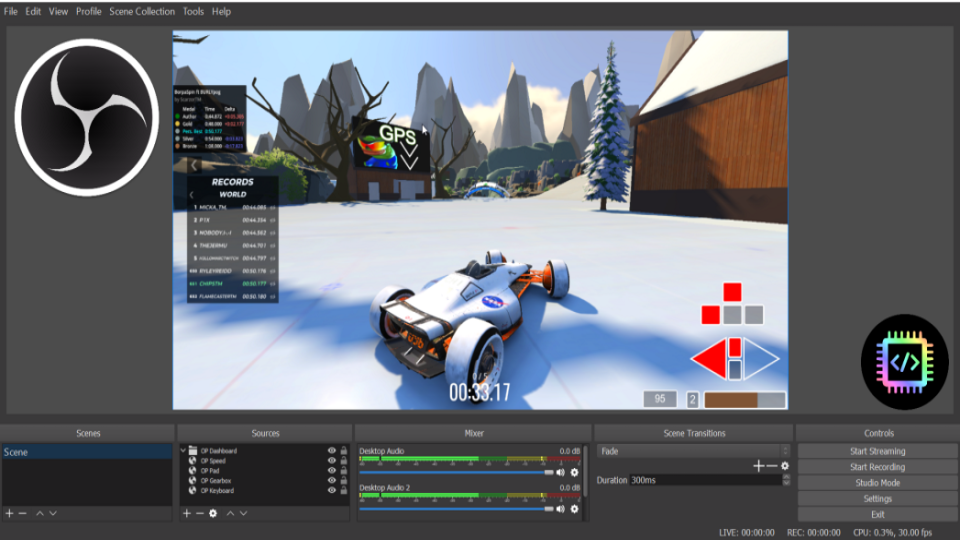

# [OBS Display](https://openplanet.dev/plugin/obsdisplay)

## An extensible way to display TM data such as VehicleState through OBS or web browser

---

## Setup Instructions
- Add OBS Browser source and select the "Local File" option (url option may be available in future)
	- There have been some presets made available under the `OpenplanetNext\PluginStorage\OBSDisplay\presets` folder
- Adjust width/height as you see fit
- Ensure both "Shutdown source when not visible" and "Refresh browser when scene becomes active" are checked
    - If the dashboard is not working as intended showing/hiding the browser source with these options enabled should fix

## Features
- Allows data from TM to be displayed in OBS or browser via WebSockets (one-way only) (NOTE: THESE ARE UNSECURE SOCKETS)
- All customization is intended to be performed in the webpage directly (use presets as a reference for customization)

Currently only the data is from VehicleState. Additional data can be made available (contact me on the Openplanet discord)

### Potential future updates
- better Presets (keyboard, pad, gearbox, speed, etc.) 
- customization window
- native HTTP Server

## Changelog

### v0.1.0
- Initial Release

